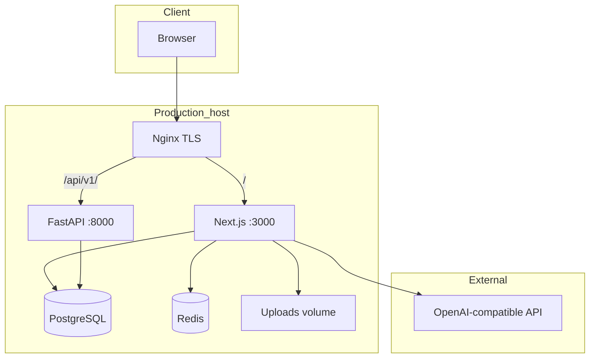
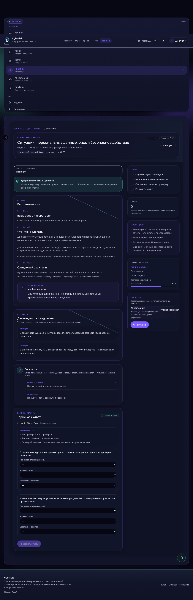
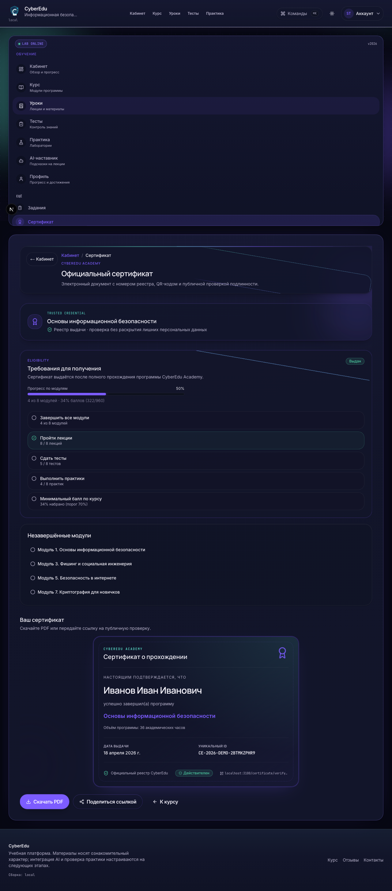

# CyberEdu — Premium Cybersecurity Learning Platform

[](https://github.com/TronTanya/info_course/actions/workflows/ci.yml)

**Русский:** [README.ru.md](./README.ru.md) · **CyberEdu** is a full-stack **LMS for information security education**: structured modules, lessons, graded tests, hands-on practice labs, an embedded **AI learning mentor**, PDF certificates with public verification, and an **admin operations dashboard**. The codebase is built for a realistic production posture—RBAC, CSRF on APIs, distributed rate limiting, security audit logging, and Docker-based deployment.

> Application root: [`cyberedu/`](./cyberedu/) · Deep docs: [`cyberedu/docs/`](./cyberedu/docs/)

---

## Short description

Students follow a linear course path (lessons → module test → practice), track progress in a learning cockpit, and can earn a verifiable certificate. Administrators manage content, review submissions, export users, and monitor platform health. An optional OpenAI-compatible API powers lesson adaptation and a guardrailed tutor that does **not** replace assessment integrity.

---

## Demo

| Resource | Status |
|----------|--------|
| **Public demo URL** | Not shipped with this repository. Deploy to your own host using [`cyberedu/docs/DEPLOYMENT.md`](./cyberedu/docs/DEPLOYMENT.md) or run locally (below). |
| **Screenshots** | Committed under [`cyberedu/docs/screenshots/`](./cyberedu/docs/screenshots/) (regenerate with `npm run screenshots` in `cyberedu/frontend`). |
| **Video walkthrough** | *Placeholder — add a link to your Loom / YouTube demo when available.* |

**Local preview (development only):**

```bash
cd cyberedu && RUN_SEED=1 docker compose up --build
# → http://localhost:3100
```

After seed, use dev accounts `student@cyberedu.local` / `admin@cyberedu.local` (passwords from your local `.env` / seed config — **never commit or reuse in production**).

---

## Features

| Area | What you get |
|------|----------------|
| **Course modules** | Ordered modules with unlock rules, lesson content, video hooks, progress sync |
| **Tests** | Server-side grading; correct answers are not exposed to the client |
| **Practice labs** | Text/file/combined tasks, phishing/URL/crypto/log scenarios, training console |
| **AI mentor** | Contextual chat + lesson adaptation; moderation pipeline; no exam/practice spoilers by design |
| **Student dashboard** | Continue learning, roadmap, weak topics, achievements, certificate progress |
| **Certificate verification** | PDF issuance + public `/certificate/verify/[code]` (minimal PII on verify page) |
| **Admin dashboard** | LMS overview (students, difficult topics, submission queue, certificates, audit events) |
| **Security controls** | JWT sessions, RBAC, API guards, CSRF, rate limits, audit log, security headers, upload restrictions |

---

## Tech stack

| Layer | Technologies |
|-------|----------------|
| **Frontend** | Next.js 16 (App Router), React 19, TypeScript, Tailwind CSS 4 |
| **Auth & data access** | NextAuth v5, Prisma 6 |
| **Database** | PostgreSQL 16 |
| **Cache / rate limit** | Redis 7 (production; in-memory fallback in dev) |
| **Backend service** | Python 3.12, FastAPI, SQLAlchemy 2 (health, internal REST, reporting hooks) |
| **AI** | OpenAI-compatible HTTP API (configurable base URL + model) |
| **PDF / QR** | `@react-pdf/renderer`, certificate verification codes |
| **Quality** | Vitest (unit + security), Playwright (E2E smoke), ESLint |
| **Ops** | Docker Compose (dev + prod), Nginx (TLS reverse proxy), optional Prometheus profile |

---

## Architecture

Primary business logic lives in **Next.js** (UI, auth, course flow, AI routes, admin). **FastAPI** complements with internal APIs and health. **PostgreSQL** is the system of record (schema owned by **Prisma Migrate**). In production, **Nginx** terminates TLS and routes `/` to Next.js and `/api/v1/` to FastAPI.



| Route zone | Paths | Access |
|------------|-------|--------|
| Marketing | `/`, public reviews | Guest |
| Auth | `/auth/*` | Guest |
| Student | `/dashboard/*` | `USER` (and `ADMIN` for learning) |
| Admin | `/admin/*` | `ADMIN` only |
| App API | `/api/*` | Per-route guard + CSRF |
| Verify | `/certificate/verify/*` | Public + rate limit |

Details: [`cyberedu/docs/ARCHITECTURE.md`](./cyberedu/docs/ARCHITECTURE.md) · [`cyberedu/docs/DATABASE.md`](./cyberedu/docs/DATABASE.md) · [`cyberedu/docs/API.md`](./cyberedu/docs/API.md)

```text
info_course/
├── README.md                 ← portfolio overview (this file)
├── .github/workflows/        ← CI, release, ops health
└── cyberedu/
    ├── frontend/             ← Next.js, Prisma, Vitest, Playwright
    ├── backend/              ← FastAPI
    ├── deploy/               ← Nginx, Prometheus, scripts
    ├── docs/                 ← security, deployment, checklists, screenshots
    ├── docker-compose.yml
    └── docker-compose.prod.yml
```

---

## Security

Implementation reference: [`cyberedu/docs/SECURITY.md`](./cyberedu/docs/SECURITY.md) · Checklist: [`cyberedu/docs/checklists/SECURITY_CHECKLIST.md`](./cyberedu/docs/checklists/SECURITY_CHECKLIST.md)

| Control | Summary |
|---------|---------|
| **RBAC** | Roles `USER` / `ADMIN`; middleware + `requireAdmin`; permission matrix in `lib/security/rbac.ts` |
| **CSRF** | Origin/Referer + double-submit cookie on mutating `/api/*` (excluding NextAuth routes) |
| **Rate limiting** | Redis-backed in production (login, AI, uploads, certificate verify, admin export); fail-closed when Redis unavailable in prod |
| **Audit log** | `SecurityAuditLog` for auth, admin actions, exports, AI refusals, etc. (`SECURITY_AUDIT_DB=0` disables DB persist) |
| **HTTP headers** | CSP (report-only → enforce path), HSTS, frame denial, referrer policy |
| **Upload restrictions** | Validated types/size; **local volume** on disk (`UPLOAD_STORAGE_DRIVER=local`) — see limitations |

Production must use `RUN_SEED=0`, `ENVIRONMENT=production`, and unique secrets from [`.env.prod.example`](./cyberedu/.env.prod.example) (never commit `.env.production`).

---

## Screenshots

Generated from seed data via Playwright (`cd cyberedu/frontend && npm run screenshots`). Copies for the marketing site live in `cyberedu/frontend/public/screenshots/`.

| | Screen | File |
|---|--------|------|
| Landing | Marketing home | [`01-landing.png`](./cyberedu/docs/screenshots/01-landing.png) |
| Dashboard | Student cockpit | [`02-dashboard.png`](./cyberedu/docs/screenshots/02-dashboard.png) |
| Course | Learning path / modules | [`03-course.png`](./cyberedu/docs/screenshots/03-course.png) |
| Lesson | Lesson reader + AI tabs | [`04-lesson.png`](./cyberedu/docs/screenshots/04-lesson.png) |
| Test | Module assessment | [`05-test.png`](./cyberedu/docs/screenshots/05-test.png) |
| Practice | Practice lab | [`06-practice.png`](./cyberedu/docs/screenshots/06-practice.png) |
| Admin | LMS admin overview | [`07-admin.png`](./cyberedu/docs/screenshots/07-admin.png) |
| Certificate | Student certificate page | [`08-certificate.png`](./cyberedu/docs/screenshots/08-certificate.png) |
| Auth | Login | [`09-login.png`](./cyberedu/docs/screenshots/09-login.png) |

<p align="center">
  
  
</p>
<p align="center">
  
  
</p>
<p align="center">
  
  
</p>
<p align="center">
  
</p>

Regenerate: Postgres + seed, then `npm run dev` (port **3100**, same host as `AUTH_URL` in `.env`, usually `localhost`) and `npm run screenshots` in `cyberedu/frontend`. Use `npm run dev`, not `npm run start`, for local capture — production mode enables `Secure` session cookies that middleware cannot read over plain HTTP.

---

## Local development

Official path: **Docker Compose** from [`cyberedu/`](./cyberedu/).

```bash
cd cyberedu
cp .env.example .env
# optional: cp frontend/.env.example frontend/.env

docker compose up --build
```

**First run with demo course data** (isolated dev only):

```bash
RUN_SEED=1 docker compose up --build
```

| Service | URL |
|---------|-----|
| App | http://localhost:3100 |
| FastAPI docs | http://localhost:18000/docs |
| pgAdmin | http://127.0.0.1:15050 |
| PostgreSQL (host) | `127.0.0.1:15432` |

Frontend-only (hot reload): see [`cyberedu/README.md`](./cyberedu/README.md) (`./scripts/design-live.sh`).

---

## Production deployment

```bash
cd cyberedu
cp .env.prod.example .env.production
chmod 600 .env.production
# Set AUTH_SECRET, POSTGRES_PASSWORD, INTERNAL_API_KEY, REDIS_PASSWORD, domains, etc.

docker compose -f docker-compose.prod.yml --env-file .env.production up -d --build
```

Required: `RUN_SEED=0`, `ENVIRONMENT=production`, `REDIS_URL`, `TRUSTED_PROXY=1` behind Nginx, persistent volume for uploads.

| Guide | Purpose |
|-------|---------|
| [`docs/DEPLOYMENT.md`](./cyberedu/docs/DEPLOYMENT.md) | VPS, SSL, compose |
| [`docs/OPERATIONS.md`](./cyberedu/docs/OPERATIONS.md) | Env, migrations, backup, admin creation, troubleshooting |
| [`docs/GO_LIVE_CHECKLIST.md`](./cyberedu/docs/GO_LIVE_CHECKLIST.md) | Pre-launch checklist |
| [`docs/checklists/FINAL_CHECKLIST.md`](./cyberedu/docs/checklists/FINAL_CHECKLIST.md) | Full pre-production |

---

## Testing

```bash
cd cyberedu/frontend
npm run lint
npm run typecheck
npm test                  # Vitest — unit + security (~260 tests)
npm run test:security     # security-focused subset
npm run test:e2e          # Playwright — requires app on :3100 + seed
```

**Production-like** (Redis + `ENVIRONMENT=production`):

```bash
cd cyberedu && docker compose up -d postgres redis
cd frontend && npm run smoke:staging:local
# or: CHECK_REDIS=1 ./scripts/staging-smoke.sh  (from cyberedu/)
```

E2E covers student login, dashboard, course, test/practice submit smoke, certificate verify page, admin users — see [`tests/e2e/smoke.spec.ts`](./cyberedu/frontend/tests/e2e/smoke.spec.ts).

CI: [`.github/workflows/ci.yml`](./.github/workflows/ci.yml) (lint, typecheck, unit tests, Playwright, Docker build).

---

## Known limitations & roadmap

Honest boundaries — do not treat this repo as a turnkey SaaS without addressing these:

| Topic | Current state | Direction |
|-------|---------------|-----------|
| **Object storage (S3)** | Uploads on **local Docker volume** only; **not** multi-replica safe | S3-compatible driver planned — [`docs/STORAGE.md`](./cyberedu/docs/STORAGE.md) |
| **Horizontal scaling** | JWT sessions without shared store; uploads pinned to one volume | Sticky sessions and/or external session store; S3 for files |
| **Full VM labs** | Browser-based training scenarios, not per-student KVM/containers | Out of scope today; possible future integration |
| **Monitoring** | Health endpoints + optional Prometheus profile; no bundled APM/dashboards | Expand observability (metrics, alerts, log aggregation) |
| **FastAPI scope** | Narrow internal API; most domain logic in Next.js | Gradual BFF/reporting extraction |
| **AI dependency** | Requires external LLM API; degraded mode without key | Documented in ops guides |
| **Manual grading** | Some TEXT test/practice items need admin review | By design for open-ended tasks |
| **Public demo** | No hosted instance in repository | Maintainer deploys separately |

Readiness notes: [`cyberedu/docs/PRODUCTION_READINESS.md`](./cyberedu/docs/PRODUCTION_READINESS.md) · Defense / pilot: [`cyberedu/docs/DEFENSE_READINESS.md`](./cyberedu/docs/DEFENSE_READINESS.md)

---

## License

[MIT License](./LICENSE) — Copyright (c) 2026 CyberEdu contributors.

---

## Documentation index

| Document | Description |
|----------|-------------|
| [`cyberedu/README.md`](./cyberedu/README.md) | Dev/prod quick start (RU) |
| [`cyberedu/docs/README.md`](./cyberedu/docs/README.md) | Full documentation index |
| [`cyberedu/docs/ARCHITECTURE.md`](./cyberedu/docs/ARCHITECTURE.md) | Components & data flows |
| [`cyberedu/docs/SECURITY.md`](./cyberedu/docs/SECURITY.md) | Threat model & controls |
| [`cyberedu/docs/screenshots/README.md`](./cyberedu/docs/screenshots/README.md) | Screenshot generation |

---

**Disclaimer:** CyberEdu is an educational engineering project. Do not expose development seeds, example secrets, or default credentials to the public internet. Operators are responsible for secrets rotation, backups, and compliance when handling real user data.
