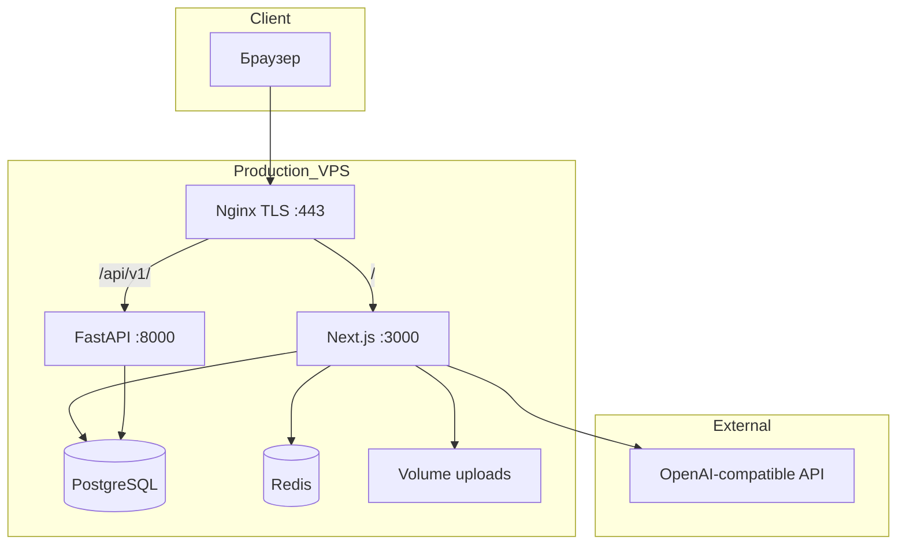
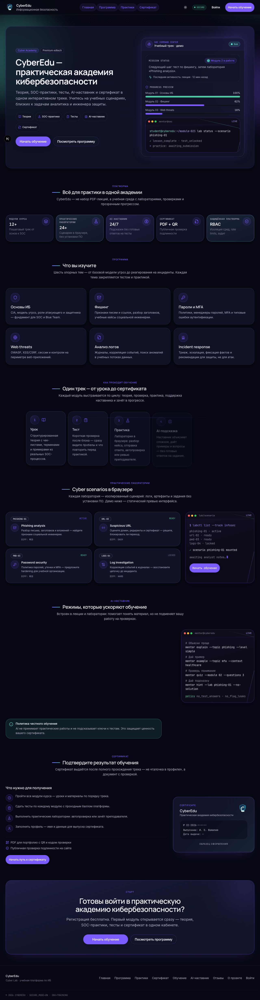
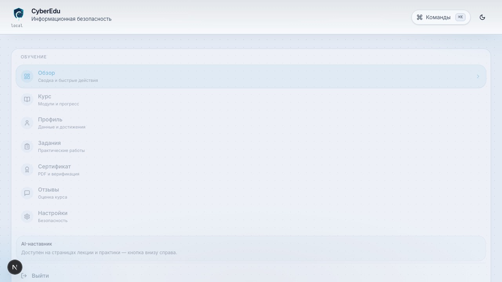
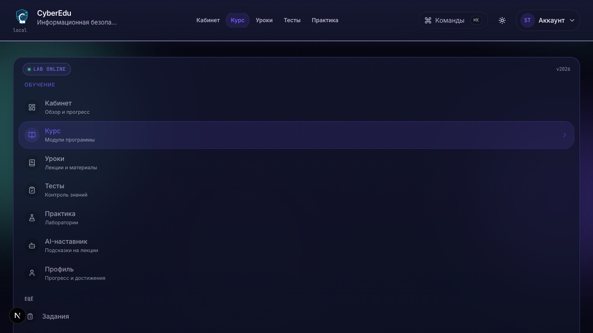
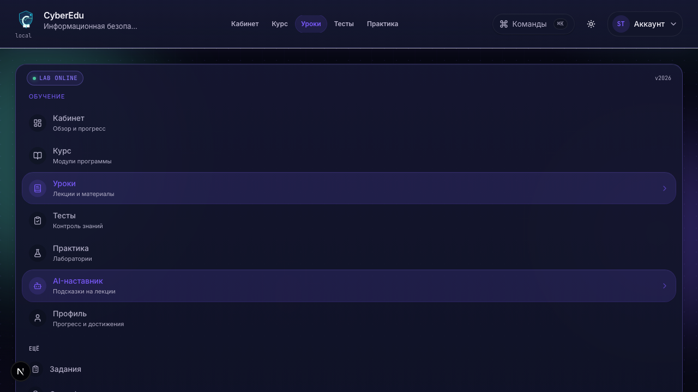
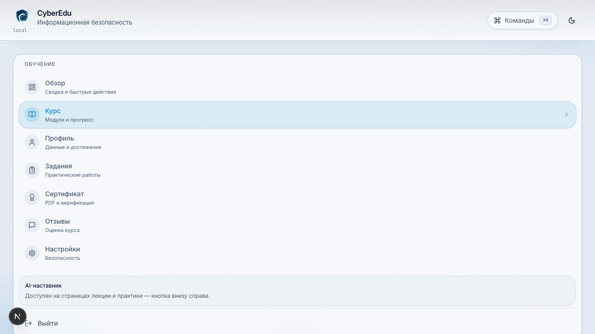
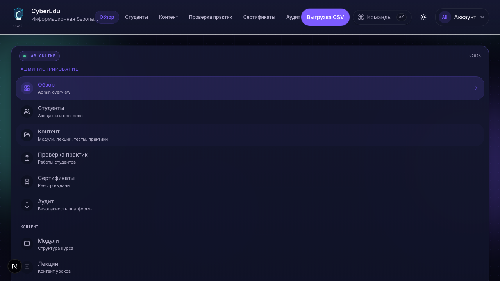

# CyberEdu

**CyberEdu** — учебно-производственная веб-платформа курса по **информационной безопасности**: структурированные модули, лекции, тесты, практические лаборатории, AI-наставник с политикой безопасности, выдача сертификата и административная панель. Проект спроектирован с учётом разделения ролей, аудита чувствительных действий и сценария развёртывания в production.

> Репозиторий: `info_course` · рабочий каталог приложения: [`cyberedu/`](./cyberedu/)

---

## 1. Краткое описание

Платформа объединяет LMS-функции и интерактивные учебные лаборатории (фишинг, URL, криптография, разбор логов и др.) в едином пользовательском пути: **регистрация → профиль с интересами → последовательное прохождение модулей → сертификат**. Отдельный акцент — **персонализация обучения**: AI адаптирует формулировки лекций под интересы студента (игры, спорт, дизайн и т.д.), не подменяя проверку знаний готовыми ответами на задания.

Технически это **монолит с двумя runtime**: основная бизнес-логика — **Next.js + Prisma**; **FastAPI** обслуживает внутренний REST и отчётность. Данные — **PostgreSQL**; в production — **Redis** (rate limit), **Nginx** (TLS), persistent volume для загрузок.

---

## 2. Цель проекта

| Задача | Реализация |
|--------|------------|
| Дать студенту понятный траекторный курс ИБ | Модули с поэтапной разблокировкой, лекции, тесты, практика |
| Закрепить материал практикой «как в поле» | Лаборатории и сценарии без выдачи эталонных решений в UI |
| Повысить вовлечённость | AI-адаптация лекций по интересам из профиля |
| Обеспечить проверяемый результат | Серверная проверка тестов, ручная/авто проверка практики, PDF-сертификат с публичной верификацией |
| Поддержать администрирование | Админ-панель: пользователи, контент, проверка работ, отзывы, экспорт |
| Продемонстрировать production-aware подход | Security headers, RBAC, audit log, rate limits, CI/E2E, docker prod stack |

---

## 3. Архитектура



### Разделение ответственности

| Компонент | Назначение |
|-----------|------------|
| **Next.js (frontend)** | UI, NextAuth, курс/тесты/практика, AI tutor, админка, Route Handlers, Prisma ORM |
| **FastAPI (backend)** | Health, internal API (`course-progress`, read-only user), задел BFF |
| **PostgreSQL** | Единая схема; **DDL владеет Prisma Migrate** |
| **Redis** (prod) | Распределённый rate limit |
| **Nginx** | TLS, reverse proxy, единая точка входа |

### Маршруты (логические зоны)

| Зона | Путь | Доступ |
|------|------|--------|
| Marketing | `/`, отзывы | Публично |
| Auth | `/auth/*` | Публично |
| Student | `/dashboard/*` | Сессия `USER` |
| Admin | `/admin/*` | Сессия `ADMIN` |
| API | `/api/*` | Per-route guard + CSRF |
| Verify | `/certificate/verify/*` | Публично + rate limit |

Подробнее: [`cyberedu/docs/ARCHITECTURE.md`](./cyberedu/docs/ARCHITECTURE.md) · БД: [`cyberedu/docs/DATABASE.md`](./cyberedu/docs/DATABASE.md)

### Структура репозитория

```text
info_course/
├── README.md                 # этот документ (обзор для защиты)
├── .github/workflows/        # CI, release, Playwright smoke
└── cyberedu/
    ├── frontend/             # Next.js, Prisma, e2e/
    ├── backend/              # FastAPI
    ├── deploy/               # nginx, prometheus, scripts
    ├── docs/                 # SECURITY, DEPLOYMENT, API, checklists
    ├── docker-compose.yml    # development
    └── docker-compose.prod.yml
```

---

## 4. Стек технологий

| Слой | Технологии |
|------|------------|
| **Frontend** | Next.js 16 (App Router), React 19, TypeScript, Tailwind CSS 4 |
| **Auth & ORM** | NextAuth v5 (JWT sessions), Prisma 6, PostgreSQL 16 |
| **Backend** | Python 3.12, FastAPI, SQLAlchemy 2, Pydantic |
| **AI** | OpenAI-compatible HTTP API (настраиваемый endpoint и модель) |
| **PDF** | `@react-pdf/renderer`, QR для верификации сертификата |
| **Quality** | Vitest, Playwright (smoke), ESLint, GitHub Actions |
| **Ops** | Docker Compose, Nginx, optional Prometheus profile |

---

## 5. Основные возможности

### Для студента

- Регистрация и профиль (ФИО, ВУЗ, **интересы для AI**)
- Курс с **линейной разблокировкой** модулей
- Лекции (блоки контента, видео при наличии)
- **AI-адаптация** лекции (упрощение, примеры, конспект)
- Тесты с **серверной** проверкой (без раскрытия эталонов клиенту)
- Практика: файлы, текст, комбинированные задания, интерактивные лаборатории
- **AI-чат наставник** в контексте урока/практики
- Прогресс, баллы, достижения
- **Сертификат PDF** после завершения курса

### Для администратора

- Управление модулями, лекциями, тестами, практическими заданиями
- Проверка отправок практики
- Пользователи и **экспорт CSV** (аудируется)
- Модерация отзывов (публикация/снятие)
- Реестр сертификатов

### Для эксплуатации

- Docker dev/prod compose
- Health endpoints (`/api/health`, `/api/v1/health`)
- Миграции Prisma в CI и при деплое
- Persistent volume для practice/avatar/certificate files

---

## 6. Security features

Реализация и чеклисты: [`cyberedu/docs/SECURITY.md`](./cyberedu/docs/SECURITY.md)

| Область | Механизм |
|---------|----------|
| **Аутентификация** | Email + пароль, bcrypt-хеш, NextAuth JWT; secure cookies в production |
| **Авторизация** | RBAC (`USER` / `ADMIN`), middleware, `requireAdmin`, permissions |
| **API** | Централизованный `withApiGuard` (auth, rate limit, Zod, audit, safe errors) |
| **CSRF** | Origin/Referer + double-submit для mutating `/api/*` |
| **Rate limiting** | Redis (prod) / in-memory (dev): login, AI, upload, cert verify, admin export |
| **HTTP headers** | CSP (report-only → enforce), HSTS, X-Frame-Options, Referrer-Policy, Permissions-Policy |
| **Uploads** | Local volume `/app/uploads` (**single replica**); S3 — planned ([`docs/STORAGE.md`](./cyberedu/docs/STORAGE.md)) |
| **Backend API** | `X-API-Key` (fail closed без ключа) |
| **Audit** | `SecurityAuditLog`: login, admin export, role change, practice review, AI refusal и др. |
| **Secrets** | Только runtime env; не в Docker build-args |
| **Production seed** | Демо-учётки **запрещены** (`RUN_SEED=0`, `ENVIRONMENT=production`) |

---

## 7. AI-наставник и ограничения

### Возможности

1. **Адаптация лекций** (`/api/ai/lesson-adapt`) — перефразирование с учётом интересов из профиля; оригинал в БД не перезаписывается.
2. **Чат-наставник** (`/api/ai/chat`) — подсказки в контексте модуля/урока; история хранится **на сервере**, клиентская история не доверяется.

### Pipeline (упрощённо)

```text
Ввод пользователя → pre-moderation → (server history) → LLM → post-moderation → ответ
```

### Ограничения (by design)

| Правило | Зачем |
|---------|--------|
| Не выдавать **готовые ответы** на тесты и практику | Академическая честность |
| Не включать в промпт **эталоны**, rubric, флаги `isCorrect` | Защита от утечки оценки |
| Отказ при jailbreak / off-topic / injection | `moderation` + шаблоны отказа |
| Rate limit per user / IP | Злоупотребление и cost control |
| Аудит отказов **без** текста prompt/ответа в логах | Privacy & forensics |
| Внешний LLM — **untrusted** boundary | Данные минимизируются, выход фильтруется |

Конфигурация: `OPENAI_API_KEY`, `OPENAI_API_BASE_URL`, `OPENAI_MODEL` (см. `.env.example`, без коммита ключей).

---

## 8. Роли пользователей

| Роль | Код | Возможности |
|------|-----|-------------|
| **Гость** | — | Главная, отзывы, вход/регистрация |
| **Студент** | `USER` | Курс, тесты, практика, AI, профиль, сертификат, отзыв |
| **Администратор** | `ADMIN` | Всё у студента + админ-панель, проверка работ, контент, экспорт |

Матрица прав: `lib/security/rbac.ts` · экспорт и PII — только `ADMIN` с аудитом.

---

## 9. Запуск (development)

Официальный способ — **Docker Compose** из [`cyberedu/`](./cyberedu/).

```bash
cd cyberedu
cp .env.example .env
# при необходимости: cp frontend/.env.example frontend/.env (Prisma с хоста)

docker compose up --build
```

**Первый запуск с демо-данными курса** (только изолированная dev-среда):

```bash
RUN_SEED=1 docker compose up --build
```

| Сервис | URL |
|--------|-----|
| Приложение | http://localhost:3100 |
| Backend OpenAPI | http://localhost:18000/docs |
| pgAdmin | http://127.0.0.1:15050 |
| PostgreSQL (с хоста) | `127.0.0.1:15432` |

### Демо-учётки (только development)

После `RUN_SEED=1` создаются учётные записи с email:

| Роль | Email (dev) |
|------|-------------|
| Администратор | `admin@cyberedu.local` |
| Студент | `student@cyberedu.local` |

**Пароли в репозиторий не входят.** Задайте их локально при seed или смените после первого входа. Подсказки — в [`cyberedu/frontend/.env.example`](./cyberedu/frontend/.env.example) и [`cyberedu/.env.example`](./cyberedu/.env.example). Повторный seed **не перезаписывает** `passwordHash` существующих пользователей.

Подробные команды, design-live, пересборка frontend: [`cyberedu/README.md`](./cyberedu/README.md)

---

## 10. Запуск (production)

Production — отдельный compose, **без seed**, внутренняя Docker-сеть, TLS на Nginx.

```bash
cd cyberedu
cp .env.prod.example .env.production
chmod 600 .env.production
# заполните секреты: AUTH_SECRET, POSTGRES_PASSWORD, INTERNAL_API_KEY, REDIS_PASSWORD, домены

docker compose -f docker-compose.prod.yml --env-file .env.production up -d --build
```

Обязательно:

- `RUN_SEED=0`, `ENVIRONMENT=production`
- Уникальные секреты (`openssl rand -base64 32`)
- `TRUSTED_PROXY=1` за Nginx
- `REDIS_URL` для rate limit
- Volume `frontend_uploads` для файлов

Пошагово: [`cyberedu/docs/DEPLOYMENT.md`](./cyberedu/docs/DEPLOYMENT.md)

**Операционные чеклисты (canonical):** [`cyberedu/docs/OPERATIONS.md`](./cyberedu/docs/OPERATIONS.md)

| Раздел в OPERATIONS.md | Содержание |
|------------------------|------------|
| Production checklist | Env vars, PostgreSQL, Redis, migrations, seed policy, Docker Compose, healthcheck, backups |
| Go-live checklist | CI green, prod e2e, Redis, rate limit, admin user, secrets, uploads, logs |
| Troubleshooting | Redis, Prisma, login/session, rate limit, uploads, AI |
| UX screenshots | `npm run screenshots` → `cyberedu/docs/screenshots/` |

Дополнительно: [`cyberedu/docs/checklists/FINAL_CHECKLIST.md`](./cyberedu/docs/checklists/FINAL_CHECKLIST.md)

### Production-like окружение локально

```bash
cd cyberedu
docker compose up -d postgres redis
cd frontend && cp .env.example .env
# DATABASE_URL + REDIS_URL=redis://127.0.0.1:6379/0
npm run test:e2e:prod:local   # migrate, seed (e2e only), playwright
```

---

## 11. Скриншоты

Каталог: [`cyberedu/docs/screenshots/`](./cyberedu/docs/screenshots/) — PNG генерируются Playwright из seed-учёток (без production-секретов).

```bash
cd cyberedu/frontend
# приложение на :3100 + seed
npm run screenshots
```

| Файл | Экран |
|------|--------|
| `01-landing.png` | Landing |
| `09-login.png` | Login |
| `02-dashboard.png` | Student dashboard |
| `03-course.png` | Course map |
| `04-lesson.png` | Lesson |
| `05-test.png` | Module test |
| `07-admin.png` | Admin dashboard |













Инструкция: [`cyberedu/docs/screenshots/README.md`](./cyberedu/docs/screenshots/README.md) · [`cyberedu/docs/OPERATIONS.md`](./cyberedu/docs/OPERATIONS.md#ux-screenshots)

Бренд-активы (SVG): [`cyberedu/frontend/public/brand/`](./cyberedu/frontend/public/brand/)

---

## 12. Roadmap

| Приоритет | Направление |
|-----------|-------------|
| **P0** | CSP `enforce` после анализа report-only; полное покрытие `withApiGuard` |
| **P1** | S3-compatible storage для uploads (multi-replica) |
| **P1** | Email-уведомления (верификация, сертификат) |
| **P2** | Расширение лабораторий и сценариев IR / SOC (в учебных границах) |
| **P2** | Вынос тяжёлой отчётности на FastAPI BFF |
| **P3** | Sticky-less sessions / horizontal scale Next.js |
| **P3** | Лидерборд с согласованием политики приватности |

Текущая оценка готовности: [`cyberedu/docs/PRODUCTION_READINESS.md`](./cyberedu/docs/PRODUCTION_READINESS.md)

---

## 13. Known limitations

| Ограничение | Комментарий |
|-------------|-------------|
| **Single-node uploads** | `UPLOAD_STORAGE_DRIVER=local` + volume `frontend_uploads`; multi-replica → S3 ([`docs/STORAGE.md`](./cyberedu/docs/STORAGE.md)) |
| **JWT sessions** | Без shared store — несколько реплик Next требуют sticky sessions |
| **AI зависит от внешнего API** | Нужен ключ и сеть; есть graceful degradation при отсутствии ключа |
| **Доменная логика в Next** | FastAPI пока узкий; не все операции вынесены на backend |
| **Seed объёмный** | Много демо-студентов для отчётности; только dev |
| **Ручная проверка TEXT-вопросов** | Часть практики требует администратора |
| **Нет полноценных изолированных VM labs** | Учебные симуляции в браузере, не KVM/контейнеры на студента |

---

## 14. Security disclaimer

1. **CyberEdu — учебный проект.** Не используйте демо-конфигурацию, дефолтные секреты из примеров `.env.example` или seed-учётки в открытых сетях и production.
2. **Не развёртывайте** с `RUN_SEED=1` или `ENVIRONMENT=development` на публичном VPS.
3. **Персональные данные** обрабатываются в рамках демонстрации; для реального внедрения нужны политика конфиденциальности, сроки хранения audit/log и согласие субъектов ПДн.
4. **AI-ответы** могут быть неточными; платформа ограничивает риски, но не заменяет преподавателя и официальные материалы курса.
5. **Ответственность** за развёртывание, патчи, бэкапы БД и ротацию секретов несёт оператор системы.
6. Сообщения об уязвимостях: укажите контакт maintainer в README вашего форка / организации (не публикуйте exploit в открытом доступе).

---

## Документация и CI

| Документ | Назначение |
|----------|------------|
| [`cyberedu/README.md`](./cyberedu/README.md) | Операционный quick start |
| [`cyberedu/docs/ARCHITECTURE.md`](./cyberedu/docs/ARCHITECTURE.md) | Архитектура |
| [`cyberedu/docs/SECURITY.md`](./cyberedu/docs/SECURITY.md) | Модель безопасности |
| [`cyberedu/docs/OPERATIONS.md`](./cyberedu/docs/OPERATIONS.md) | Production / go-live / troubleshooting |
| [`cyberedu/docs/DEPLOYMENT.md`](./cyberedu/docs/DEPLOYMENT.md) | Production deploy |
| [`cyberedu/docs/API.md`](./cyberedu/docs/API.md) | HTTP API |
| [`cyberedu/docs/checklists/`](./cyberedu/docs/checklists/) | Release / Security / Deploy |

**CI:** [`.github/workflows/ci.yml`](./.github/workflows/ci.yml) (lint, typecheck, unit tests, Playwright smoke, Docker build) · **Release:** [`.github/workflows/release.yml`](./.github/workflows/release.yml)

---

*Документ подготовлен для дипломной / курсовой защиты и онбординга разработчиков. Актуальность инфраструктурных деталей сверяйте с `docker-compose*.yml` и `docs/`.*
