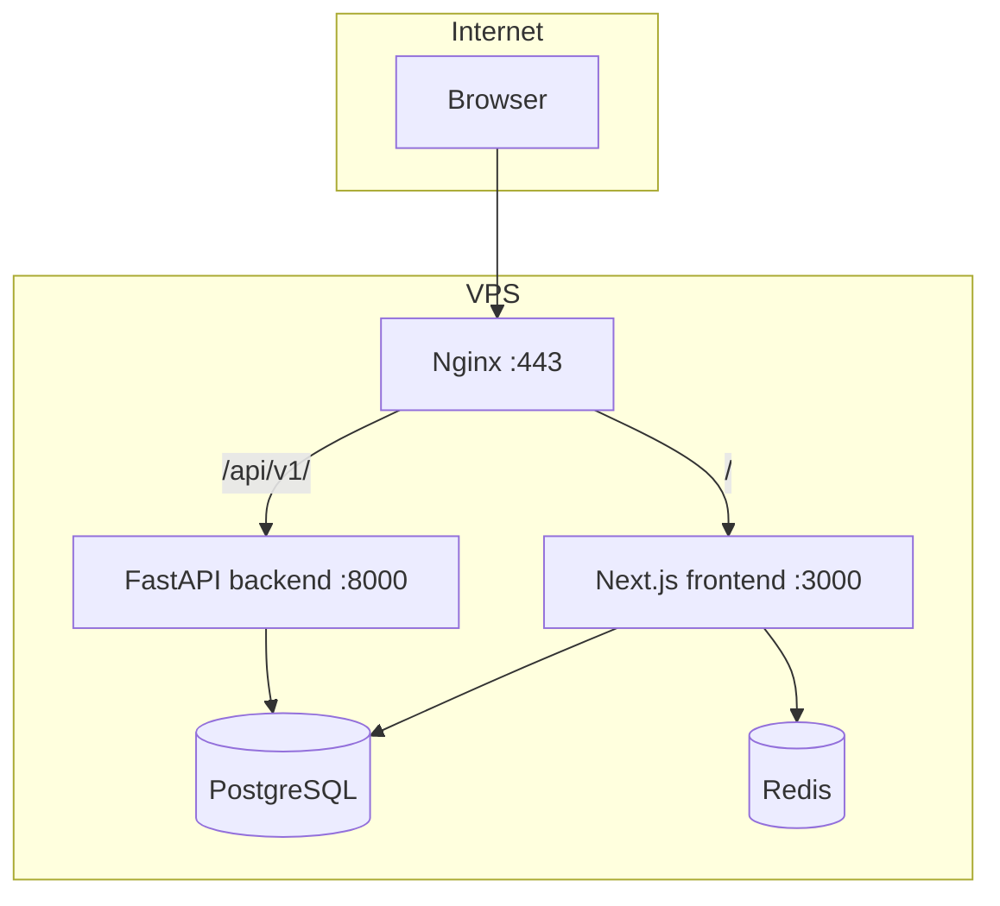

# ARCHITECTURE — CyberEdu

## Обзор

CyberEdu — монолитная образовательная платформа с **двумя runtime**:

| Слой | Технология | Ответственность |
|------|------------|-----------------|
| **Primary app** | Next.js 16 (App Router) | UI, auth, курс, тесты, практика, AI, админка, Prisma ORM |
| **Service API** | FastAPI | Health, internal REST (`course-progress`, `users`), задел BFF |
| **Data** | PostgreSQL 16 | Единое хранилище |
| **Cache** | Redis 7 (prod) | Rate limit, будущий кэш AI |



## Репозиторий

```text
info_course/                    # git root
├── .github/workflows/          # CI, release → GHCR
├── README.md                   # указатель на cyberedu/
└── cyberedu/
    ├── frontend/               # Next.js + Prisma
    ├── backend/                # FastAPI + SQLAlchemy
    ├── deploy/                 # nginx, prometheus, scripts
    ├── docs/                   # architecture, security, checklists
    ├── docker-compose.yml      # dev
    └── docker-compose.prod.yml # production
```

## Frontend (Next.js)

### Маршрутизация

| Зона | Путь | Защита |
|------|------|--------|
| Marketing | `/`, `/(public)/*` | Public |
| Auth | `/auth/*` | Public |
| Student | `/dashboard/*` | Session required |
| Admin | `/admin/*` | Session + `ADMIN` |
| API | `/api/*` | Per-route auth + CSRF |
| Verify | `/certificate/verify/*` | Public + rate limit |

### Слои кода

```text
app/                    # routes (RSC + client)
components/             # UI + domain (admin, practice, lesson, ai)
lib/
  auth.ts               # NextAuth
  db.ts                 # Prisma client
  security/             # headers, CSRF, RBAC, rate-limit, audit
  ai/tutor/             # pipeline, moderation, memory
  actions/              # Server Actions
prisma/                 # schema + migrations
```

**Паттерн:** Server Components загружают данные; мутации через Server Actions или Route Handlers; клиентские острова для интерактива (тесты, AI chat, practice labs).

### Аутентификация

- **NextAuth v5** (JWT session strategy)
- Роли: `USER`, `ADMIN` в token
- Middleware: redirect + security headers + coarse rate limits

## Backend (FastAPI)

- Слои: `api` → `services` → `repositories` → `models`
- **Alembic** миграции для SQLAlchemy-моделей (частично пересекаются с Prisma)
- Production: OpenAPI disabled; CORS из env
- Защита: `require_internal_api_key` на v1 business routes

## Данные и миграции

| Инструмент | Схема | Когда применяется |
|------------|-------|-------------------|
| Prisma Migrate | Основная учебная модель | `frontend-migrate` (prod), entrypoint (dev) |
| Alembic | Backend models (`course_progress`, users UUID) | Manual / backend container |

> **Tech debt:** две ORM на одной БД. Правило: новые учебные сущности — только Prisma; backend — read/reporting или явно согласованные таблицы.

## AI subsystem

```text
POST /api/ai/chat
  → auth + module access guards
  → rate limit (IP + user)
  → runTutorPipeline
       pre-moderation → memory → LLM → post-moderation → recommendations
```

Конфиг: `OPENAI_API_KEY`, `OPENAI_API_BASE_URL`, `OPENAI_MODEL`.

## Security architecture

См. [SECURITY.md](./SECURITY.md). Кратко:

- Edge: Nginx TLS termination
- App: CSP, CSRF, RBAC, upload sandbox
- Data: bcrypt passwords, no secrets in client bundle

## Deployment topology

См. [DEPLOYMENT.md](./DEPLOYMENT.md).

- **Dev:** `docker-compose.yml` — порты 3100, 18000, 15432, pgAdmin
- **Prod:** `docker-compose.prod.yml` — только Nginx наружу, internal network

## Масштабирование (текущие ограничения)

| Компонент | Single-node | Multi-replica |
|-----------|-------------|---------------|
| Next.js | OK | Sticky sessions or shared session store |
| Rate limit | In-memory / partial Redis | **Requires Redis** |
| Uploads | Local volume | S3-compatible object storage |
| Postgres | Single instance | Managed DB + connection pooler |

## Наблюдаемость

- Liveness: `/api/health` (frontend), `/api/v1/health` (backend)
- Logs: Docker json-file
- Metrics: optional Prometheus profile (`deploy/prometheus/`)

## Эволюция (рекомендуемая)

1. Единый `withApiGuard` на все Route Handlers
2. BFF: Next вызывает FastAPI только для reporting/export at scale
3. Object storage для uploads
4. E2E + contract tests в CI
