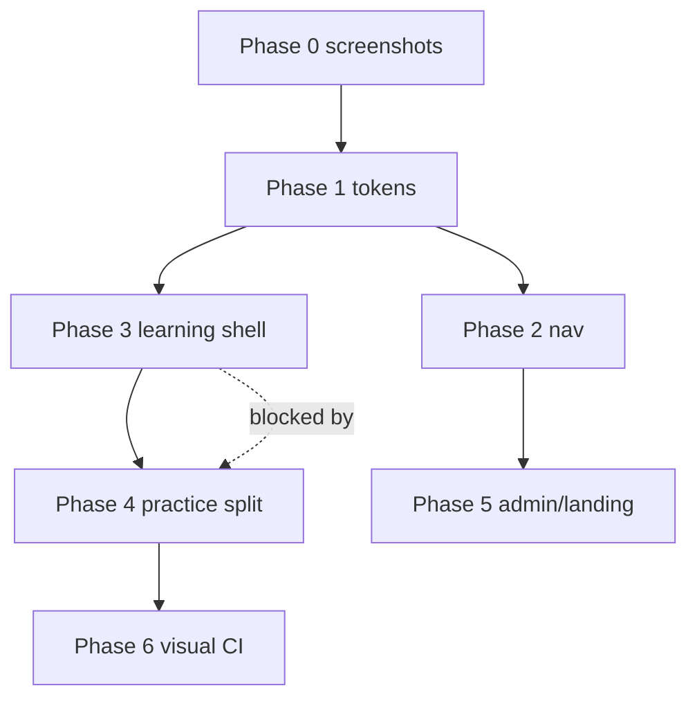

# CyberEdu — матрица редизайна (маршрут × компонент × риск)

Документ для разбиения UI/UX-работ на Issues без изменения доменной логики.  
Связанные документы: [DESIGN_AUDIT.md](./DESIGN_AUDIT.md), [DEPLOYMENT.md](./DEPLOYMENT.md).

**Легенда риска**

| Уровень | Значение |
|---------|----------|
| **L** | Low — стили, копирайт, layout-оболочка; не трогает progress/submissions/grading |
| **M** | Medium — shell/nav/header; косвенно влияет на все дочерние страницы |
| **H** | High — practice hub, forms с server actions, progress messaging |
| **C** | Critical — auth, middleware, progress engine, API grading; **не в scope визуального PR** |

**Легенда фазы** (из плана редизайна)

| Фаза | Фокус |
|------|--------|
| 0 | Baseline / screenshots / CI |
| 1 | Tokens & primitives |
| 2 | Navigation |
| 3 | Learning shell |
| 4 | Practice split |
| 5 | Admin & landing polish |
| 6 | Validation / rollout |

---

## 1. Student — маркетинг и auth

| Маршрут | Layout / Shell | Ключевые компоненты | error | loading | Риск | Фаза | Issue (черновик) |
|---------|----------------|---------------------|:-----:|:-------:|:----:|:----:|------------------|
| `/` | `LandingShell` | `landing-hero`, `landing-metrics`, `landing-learning-path`, `landing-practice-lab`, `landing-cta`, `landing-header` | — | root `loading.tsx` | L | 5 | `ui: landing sections → SectionCard / cyber tokens` |
| `/about` | `(public)/MarketingShell` | about page content | — | — | L | 5 | `ui: public about page semantic tokens` |
| `/(public)/reviews` | MarketingShell | `public-reviews-grid` | — | — | L | 5 | `ui: public reviews grid polish` |
| `/auth/login` | `auth/layout` → `AuthSplitLayout` | `LoginForm`, `AuthGlassCard`, `AuthVisualPanel` | `auth/error` | — | M | 2 | `ux: auth layout mobile + callbackUrl hint` |
| `/auth/register` | auth layout | `RegisterForm` | auth/error | — | M | 2 | `ui: register form align auth-glass` |
| `/auth/forgot-password` | auth layout | `ForgotPasswordForm` | auth/error | — | L | 2 | `ui: forgot-password visual parity` |
| `/auth/reset-password` | auth layout | `ResetPasswordForm` | auth/error | — | L | 2 | `ui: reset-password visual parity` |
| `/certificate/verify/[code]` | root only | verify page, `SectionCard`, `Alert` | — | — | L | 5 | `ui: certificate verify public page` |

**Не трогать в UI-PR:** `lib/auth.ts`, `middleware.ts` (редиректы), `lib/actions/password-reset.ts` — **C**.

---

## 2. Student — dashboard и курс

| Маршрут | Layout / Shell | Ключевые компоненты | error | loading | Риск | Фаза | Issue (черновик) |
|---------|----------------|---------------------|:-----:|:-------:|:----:|:----:|------------------|
| `/dashboard` | `dashboard/layout` → `DashboardShell` | `dashboard-home`, welcome, continue-learning, roadmap, progress-overview, recent-activity | `dashboard/error` | `dashboard/loading` | M | 2 | `ui: dashboard home widget density + tokens` |
| `/dashboard/profile` | DashboardShell | profile view, achievements | dashboard/error | profile/loading | L | 1 | `ui: profile page SectionCard consistency` |
| `/dashboard/profile/edit` | DashboardShell | `profile-edit-form` | dashboard/error | — | M | 3 | `ui: profile edit form fields` |
| `/dashboard/settings` | DashboardShell | settings forms | dashboard/error | settings/loading | L | 1 | `ui: settings page states` |
| `/dashboard/certificate` | DashboardShell | certificate panel | dashboard/error | certificate/loading | M | 3 | `ux: certificate CTA clarity` |
| `/dashboard/reviews` | DashboardShell | student review form | dashboard/error | reviews/loading | L | 1 | `ui: student reviews form` |
| `/dashboard/my-assignments` | DashboardShell + `LearnPageShell` | `MyAssignmentsList`, `UiStatePanel` | dashboard/error | — | L | 1 | `ui: assignments list mobile cards` |
| `/dashboard/course` | DashboardShell (wide) | `CoursePageShell`, `CourseLearningPath`, `CourseEmpty` | `course/error` | course/loading | M | 3 | `ux: course map locked module messaging` |
| `/dashboard/course/[moduleId]` | DashboardShell | `ModuleLearningShell`, `LearningLayout`, `ModuleOverviewPanel`, hub steps | course/error | module/loading | **H** | 3 | `ux: module hub unified step chrome` |
| `/dashboard/course/[moduleId]/lesson` | DashboardShell | `LessonPageClient`, `LessonLayout`, structured text, aside, `AiMentorChat` | lesson/error | lesson/loading | **H** | 3 | `ux: lesson layout align with module stepper` |
| `/dashboard/course/[moduleId]/test` | DashboardShell | `LearnPageShell`, `StudentPageHeader`, `ModuleTestRunner` | **нет** | test/loading | **H** | 3 | `ux: test page add error.tsx + step breadcrumbs` |
| `/dashboard/course/[moduleId]/practice` | DashboardShell | **`PracticePageClient`**, `PracticeLabLayout`, lab chrome, task UIs | **нет** | practice/loading | **H** | 4 | `refactor: practice-page-client split (shell only)` |

**Critical (только с QA + domain review):** `lib/progress.ts`, `lib/course-progress-guards.ts`, `canAccessModule`, `assertModuleAccess` — **C**.

---

## 3. Student — shared layout / nav

| Зона | Файлы | Риск | Фаза | Issue (черновик) |
|------|-------|:----:|:----:|------------------|
| Sidebar | `app-sidebar.tsx`, `nav-config.ts` (`studentNav`) | M | 2 | `ux: student sidebar labels + icons audit` |
| Mobile bottom nav | `dashboard-bottom-nav.tsx` (4 пункта) | M | 2 | `ux: bottom nav «Ещё» — cert/settings/reviews` |
| Immersive hide nav | `dashboard-content-area.tsx` (lesson/practice/test) | M | 2 | `ux: immersive routes exit affordance` |
| Site header | `site-header.tsx`, `site-header-nav.tsx` | L | 2 | `ui: site header marketing vs dashboard` |
| Command palette | `command-palette.tsx` | L | 2 | `ui: command palette discoverability` |
| Learn chrome | `learn-chrome.tsx` (`LearnPageHeader`, `LearnPageShell`) | M | 3 | `ui: unify LearnPageHeader with PageHeaderCore` |
| Cyber chrome | `components/cyber/*` | M | 1 | `ui: CyberPageHeader single contract` |

---

## 4. Admin

| Маршрут | Shell | Ключевые компоненты | error | loading | Риск | Фаза | Issue (черновик) |
|---------|-------|---------------------|:-----:|:-------:|:----:|:----:|------------------|
| `/admin` | `AdminShell` | KPI grid, charts, quick actions, activity | `admin/error` | `admin/loading` | L | 5 | `ui: admin dashboard chart empty states` |
| `/admin/profile` | AdminShell | `admin-profile-view`, security dashboard | admin/error | admin/loading | L | 5 | `ui: admin security profile slate cleanup` |
| `/admin/users` | AdminShell | `AdminUsersTable`, `UiStatePanel` | admin/error | admin/loading | M | 5 | `ui: users table filter empty state` |
| `/admin/users/[id]` | AdminShell | user detail, `SectionCard` | admin/error | admin/loading | L | 5 | `ui: user detail cards` |
| `/admin/modules` | AdminShell | `AdminDualTable`, `UiStatePanel` | admin/error | admin/loading | L | 5 | `ui: modules list mobile cards` |
| `/admin/modules/new`, `.../edit` | AdminShell | module forms, `AdminPageHeader` | admin/error | admin/loading | M | 5 | `ui: module edit form layout` |
| `/admin/lessons` | AdminShell | lessons list, `UiStatePanel` | admin/error | admin/loading | L | 2 | `ux: add lessons to adminNav` |
| `/admin/lessons/[id]/edit` | AdminShell | lesson editor | admin/error | admin/loading | M | 5 | `ui: lesson edit admin header` |
| `/admin/tests` | AdminShell | tests list | admin/error | admin/loading | L | 2 | `ux: add tests to adminNav` |
| `/admin/tests/new`, `.../edit` | AdminShell | `AdminTestQuestionCard` | admin/error | admin/loading | M | 5 | `ui: test editor question cards` |
| `/admin/practical-tasks` | AdminShell | tasks list | admin/error | admin/loading | L | 2 | `ux: add practical-tasks to adminNav` |
| `/admin/practical-tasks/new`, `.../edit` | AdminShell | task type editor | admin/error | admin/loading | **H** | 5 | `ui: practical task edit — type-specific hints` |
| `/admin/submissions` | AdminShell | `AdminFilterTabs`, `UiStatePanel` | admin/error | admin/loading | L | 5 | `ui: submissions queue filters mobile` |
| `/admin/submissions/[id]` | AdminShell | `AdminSubmissionReviewForm` | admin/error | admin/loading | **H** | 5 | `ux: submission review layout (no grade logic change)` |
| `/admin/certificates` | AdminShell | registry table | admin/error | admin/loading | L | 5 | `ui: certificates registry table` |
| `/admin/reviews` | AdminShell | moderation UI | admin/error | admin/loading | L | 5 | `ui: admin reviews moderation` |
| `/admin/ui-kit`, `/dev/ui-kit` | dev | `ui-kit-showcase` (legacy `Card`) | — | — | L | 1 | `chore: ui-kit showcase SectionCard migration` |

**Admin nav gap (отдельный issue):** `adminNav` / `AdminMobileNav` не содержат lessons, tests, practical-tasks — **M**, фаза **2**.

**Critical:** `lib/actions/admin-*`, submission review score, export API — **C**.

---

## 5. Practice — матрица по типу задания

Центральный файл: `components/practice/practice-page-client.tsx` → `ScenarioPracticeBlock` / forms.

| PracticalTaskType | UI-компонент | API / action | Риск | Фаза | Issue (черновик) |
|-------------------|--------------|--------------|:----:|:----:|------------------|
| `TEXT_ANSWER` | Text form + `PracticeLabTerminal` | `submitPracticeTextAction` | H | 4 | `ui: practice TEXT_ANSWER terminal form` |
| `FILE_UPLOAD` | file input + terminal hint | upload + submit actions | H | 4 | `ui: practice FILE_UPLOAD upload UX` |
| `COMBINED` | text + file | combined submit | H | 4 | `ui: practice COMBINED dual submit` |
| `INTERACTIVE` | `TrainingConsole` / legacy | `verifyPracticeInteractiveAction` | H | 4 | `ui: practice INTERACTIVE console` |
| `TRAINING_CONSOLE` | `TrainingConsole` | interactive verify | H | 4 | `ui: practice TRAINING_CONSOLE` |
| `SITUATION_CHOICE` | `scenario-practice-forms` | structured submit | M | 4 | `ui: practice SITUATION_CHOICE` |
| `PASSWORD_ANALYSIS` | scenario forms | structured submit | M | 4 | `ui: practice PASSWORD_ANALYSIS` |
| `PHISHING_ANALYSIS` | `PhishingEmailTask` | `/api/practice/phishing/check` | M | 4 | `ui: practice PHISHING polish` |
| `URL_ANALYSIS` | `UrlAnalysisTask` | `/api/practice/url-analysis/check` | M | 4 | `ui: practice URL_ANALYSIS table mobile` |
| `CRYPTO_TASK` | `CryptoTask` | `/api/practice/crypto/check` | M | 4 | `ui: practice CRYPTO steps` |
| `LOG_ANALYSIS` | `LogAnalysisTask` | `/api/practice/log-analysis/check` | M | 4 | `ui: practice LOG terminal + steps` |
| `CHECKLIST` | checklist UI | structured submit | M | 4 | `ui: practice CHECKLIST` |

Shared: `practice-task-ui.tsx`, `practice-lab-scenario.tsx`, `practice-lab-result.tsx`, `practice-lab-aside.tsx` — **M**, фаза **4**.

**Critical:** все `app/api/practice/*`, `lib/actions/practice.ts`, auto-check scoring libs — **C**.

---

## 6. Design system — файлы-якоря

| Файл | Назначение | Риск | Фаза | Issue (черновик) |
|------|------------|:----:|:----:|------------------|
| `app/design-tokens.css` | CSS variables, terminal SOC | M | 1 | `ui: design tokens audit light/dark` |
| `app/globals.css` | ce-* utilities, typo, terminal | M | 1 | `ui: globals slate-* removal sweep` |
| `lib/design-system/tokens.ts` | TS token mirror | L | 1 | `chore: sync tokens.ts with CSS` |
| `lib/design-system/cyber.ts` | class bundles | L | 1 | `ui: cyber.ts admin/marketing bundles` |
| `lib/design-system/primitives.ts` | input/card surfaces | L | 1 | `ui: form primitives focus ring audit` |
| `components/ui/section-card.tsx` | primary surface | L | 1 | `ui: SectionCard variant guidelines doc` |
| `components/ui/lab-terminal.tsx` | SOC terminal | M | 1 | `ui: LabTerminal a11y + mobile` |
| `components/ui/ui-state-panel.tsx` | empty/loading/error | L | 1 | `ui: UiStatePanel student empty routes` |
| `components/ui/state-shell.tsx` | empty state chrome | L | 1 | `ui: StateShell terminal line consistency` |

**Остаточный долг:** ~17 файлов с `slate-*` (см. grep) — один issue: `chore: remove slate-* from frontend`.

---

## 7. Тесты и production — что проверять после каждого UI PR

| Область | Команда / артефакт | Риск регрессии |
|---------|-------------------|----------------|
| Unit/integration | `cd cyberedu/frontend && npm run typecheck && npm test` | L–M |
| Security suite | `npm run test:security` | C-adjacent |
| E2E dev | `npm run test:e2e` → `tests/e2e/smoke.spec.ts` | M |
| E2E prod smoke | `playwright.prod.config.ts` | M |
| Screenshots | `playwright.screenshots.config.ts` | L |
| Progress pure | `tests/progress-pure.test.ts`, `learning-nav.test.ts` | **C** if nav URLs change |
| Practice | `practice-progress-engine.test.ts`, `practice-files.test.ts` | **C** if routes/actions change |
| Deploy | `docker-compose.prod.yml`, nginx | C — out of UI scope |

**Фаза 0 issue:** `chore: baseline playwright screenshots for redesign routes`.

---

## 8. Рекомендуемый порядок Issues (GitHub)

### Milestone: Redesign — Foundation
1. `chore: baseline playwright screenshots (phase 0)`
2. `chore: remove slate-* from frontend (phase 1)`
3. `ui: PageHeaderCore + thin Cyber/Learn/Admin/Student wrappers (phase 1)`
4. `ui: design tokens audit light/dark (phase 1)`

### Milestone: Redesign — Navigation
5. `ux: student bottom nav «Ещё» menu (phase 2)`
6. `ux: adminNav — lessons, tests, practical-tasks (phase 2)`
7. `ux: immersive routes exit affordance (phase 2)`

### Milestone: Redesign — Learning path
8. `ux: module hub unified step chrome (phase 3)`
9. `ux: test page error.tsx + breadcrumbs (phase 3)`
10. `ux: lesson layout align with module stepper (phase 3)`
11. `ux: course map locked module messaging (phase 3)`

### Milestone: Redesign — Practice
12. `refactor: extract PracticeLabShell from practice-page-client (phase 4)`
13. `refactor: PracticeTaskRouter by taskType (phase 4)`
14. `ui: practice auto-task mobile QA (phishing/url/crypto/log) (phase 4)`

### Milestone: Redesign — Polish
15. `ui: landing sections token pass (phase 5)`
16. `ui: admin submission review layout (phase 5)`
17. `test: visual regression CI gate (phase 6)`

---

## 9. Зависимости между Issues



- **Practice split (4)** не начинать до **module step chrome (3)** — иначе двойная переделка breadcrumbs.
- **adminNav (2)** можно параллельно с **tokens (1)**.
- Любой PR с **H** в practice/admin review — обязателен manual E2E: login → module → practice submit → admin check.

---

## 10. Шаблон Issue (копировать)

```markdown
## Scope
- Route(s): 
- Components: 
- Out of scope: progress.ts, course-progress-guards, prisma, API routes

## Risk
- [ ] L / M / H (не C)

## Phase


## Acceptance
- [ ] typecheck + test green
- [ ] 320px / 768px / 1280px checked
- [ ] light + dark
- [ ] E2E smoke (if student/admin flow touched)

## Screenshots
- Before / After
```

---

*Сгенерировано для backlog редизайна CyberEdu. Обновлять при добавлении маршрутов или смене shell.*
