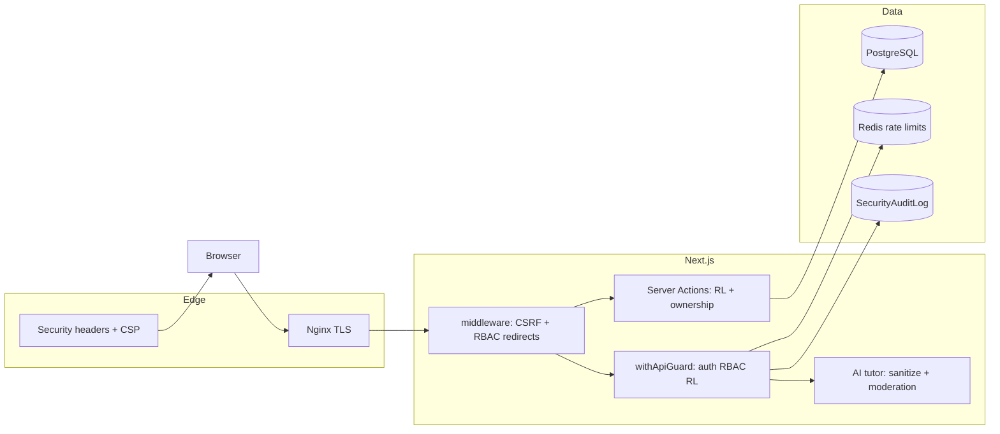

# Безопасность как преимущество CyberEdu

Курс посвящён информационной безопасности — платформа демонстрирует те же принципы в коде, конфигурации и эксплуатации. Этот документ — **краткая витрина для защиты, портфолио и onboarding**, без раскрытия секретов и внутренних путей хранения.

Модель угроз: [THREAT_MODEL.md](./THREAT_MODEL.md) · Реализация контролей: [SECURITY.md](./SECURITY.md) · Чеклист релиза: [checklists/SECURITY_CHECKLIST.md](./checklists/SECURITY_CHECKLIST.md).

## Принципы

| Принцип | Как реализовано |
|---------|-----------------|
| **Fail-closed** | Production без Redis для rate limit → отказ, не «тихий» bypass |
| **Server-side truth** | Оценка тестов/практики, RBAC, AI-контекст — только на сервере |
| **Defense in depth** | Middleware + layout + Server Actions + `withApiGuard` |
| **Минимизация данных** | Audit без паролей, email, prompt/ответов AI; verify без лишних ПДн |
| **Учебная честность** | AI не получает эталоны тестов/рубрики; модерация до и после LLM |

## Карта контролей



## Аутентификация и сессии

- NextAuth JWT, bcrypt для паролей
- Production: `AUTH_SECRET` ≥ 32 символов, hardened cookies (`__Secure-`, `httpOnly`, `sameSite=lax`)
- Rate limit на login и credentials callback (Redis)
- Блокировка после 8 неудачных попыток — **Redis** (`login-attempts`, shared across replicas)
- Hardened session cookies (`__Secure-`, `httpOnly`, `sameSite=lax`)

## RBAC и маршруты

| Зона | USER | ADMIN |
|------|------|-------|
| `/dashboard/*` (кроме публичного hub курса) | ✓ (auth) | ✓ |
| `/admin/*` | ✗ → access-denied | ✓ |
| Admin API / export | ✗ | ✓ + permission |
| Чужие submission / PDF | ✗ | ✓ (review) |

Дублирование: `middleware.ts`, `app/admin/(protected)/layout.tsx`, `requireAdmin()`, `lib/security/rbac.ts`.

## API: CSRF, rate limit, guard

- **CSRF:** mutating `/api/*` проверяют `Origin` / `Referer` (кроме `/api/auth/*`)
- **Rate limit:** централизованно в `rate-limit-service.ts` (Redis + dev in-memory)
- **Route Handlers:** все на `withApiGuard` / `withAuthApiRoute` / `withPublicApiRoute`
- **CSP reports:** `POST /api/csp-report` (санитизация, rate limit, audit `security.csp.report`)

## Оценка тестов и практик

- Ответы проверяются на сервере (`test-grading`, practice engines)
- Клиенту не отдаются `isCorrect` для вариантов до завершения попытки; пояснения через `safeTestExplanation`
- Server Actions: `enforceServerActionRateLimit` до обращения к Prisma
- Upload: allowlist, размер, magic bytes (`upload-sandbox.ts`)

## AI-наставник (academic integrity)

- Запрещённые ключи контекста (`forbidden-context.ts`) + глубокая очистка с клиента
- Сервер пересобирает контекст из БД (`buildServerAIMentorContext`)
- Pre/post модерация, отказ на «дай ответ теста»
- История чата на сервере; practice surface без persist history
- Rate limit: per user + per IP на `/api/ai/*`

## Аудит

`SecurityAuditLog` + JSON в stdout (SIEM). Примеры событий:

- `auth.login.*`, `auth.register.success`
- `admin.*`, `certificate.*`, `ai.safety.*`
- `security.csp.report`

Отключение записи в БД: `SECURITY_AUDIT_DB=0` (логи в stdout остаются).

## HTTP-заголовки и CSP

- HSTS, X-Frame-Options, Referrer-Policy, Permissions-Policy, COOP/CORP
- CSP: rollout `report-only` → `enforce` (`CSP_MODE`)
- Опционально: `CSP_REPORT_URI=/api/csp-report`

## Что проверить перед демо/релизом

```bash
cd cyberedu/frontend
npm run test:security
npm run check:rate-limit   # из корня cyberedu — production Redis policy
npm test
npm run build
```

## Ограничения (честно)

- Горизонтальное масштабирование требует Redis для rate limit
- Prompt injection — частичная модерация (не замена WAF)
- Local uploads — single replica (см. [STORAGE.md](./STORAGE.md))
- S3 driver — skeleton only

## Публичная витрина

- Страница **`/security`** — обзор контролей для студентов и ревьюеров (без секретов)
- **`/.well-known/security.txt`** — контакт для ответственного disclosure

## Ссылки

- [THREAT_MODEL.md](./THREAT_MODEL.md) — активы, угрозы, gaps
- [SECURITY.md](./SECURITY.md) — реализация контролей
- [DEFENSE_READINESS.md](./DEFENSE_READINESS.md) — сценарии для защиты
- [OPERATIONS.md](./OPERATIONS.md) — env, Redis, admin, backup
