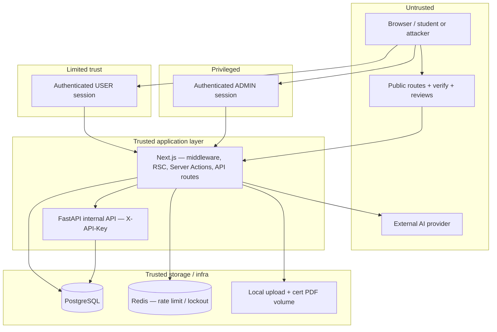

# Threat Model — CyberEdu / info_course

Модель угроз для LMS CyberEdu (курс по информационной безопасности). Описывает **что защищаем**, **границы доверия**, **типовые угрозы**, **существующие контроли** и **реальные пробелы** (без выдуманных пунктов).

Операционные детали (лимиты, env, чеклисты, тесты): [SECURITY.md](./SECURITY.md) · [checklists/SECURITY_CHECKLIST.md](./checklists/SECURITY_CHECKLIST.md) · витрина: [SECURITY_PLATFORM.md](./SECURITY_PLATFORM.md).

**Scope:** frontend Next.js (основная логика LMS), FastAPI internal API, PostgreSQL, Redis, локальное хранилище upload/PDF, внешний LLM (OpenAI-compatible). Не входит: инфраструктура VPS/Nginx/certbot (см. [OPERATIONS.md](./OPERATIONS.md)).

---

## 1. Assets (активы)

| Актив | Содержимое / ценность | Где хранится / обрабатывается | Класс чувствительности |
|-------|------------------------|------------------------------|-------------------------|
| **Аккаунты пользователей** | email, `passwordHash` (bcrypt), роль `USER`/`ADMIN`, профиль | PostgreSQL (`User`); сессия — JWT в cookie | **Высокий** |
| **Прогресс студентов** | завершение модулей/уроков, баллы, статусы шагов | PostgreSQL (`UserProgress`, связанные таблицы) | **Средний** (учебные данные) |
| **Ответы тестов** | попытки, выбранные варианты, баллы, эталоны `isCorrect` | PostgreSQL; оценка — server-only (`test-grading`) | **Высокий** (целостность оценки) |
| **Решения практик** | тексты, файлы, статусы submission, комментарии проверяющего | PostgreSQL + volume uploads | **Высокий** |
| **Сертификаты** | `certificateNumber`, `verificationCode`, `issuedAt`, `revokedAt`, PDF | PostgreSQL; PDF на диске; публичный verify — ограниченный набор полей | **Высокий** (репутация/подделка) |
| **Admin actions** | выдача/отзыв сертификатов, проверка практик, смена ролей, публикация контента, CSV export | Server Actions + Prisma; след в audit | **Высокий** |
| **Audit log** | `SecurityAuditLog` + JSON stdout (SIEM) | PostgreSQL + логи контейнера | **Средний** (расследование, без паролей в meta) |
| **AI context** | уроки (excerpt), описание практики, история чата (сервер), промпты к LLM | PostgreSQL (`AiChat` и др.); запросы к внешнему API | **Высокий** (утечка assessment + injection) |
| **Uploaded files** | вложения практик, аватары | Local volume (`UPLOADS_DIR`); доступ через auth API | **Средний–высокий** (malware, path traversal) |
| **Environment secrets** | `AUTH_SECRET`, `INTERNAL_API_KEY`, `POSTGRES_*`, `REDIS_*`, `OPENAI_API_KEY` | `.env` / secret manager; **не в git** | **Критический** |

**Не считаем публичным активом:** полный каталог уроков на hub `/dashboard/course` (демо-навигация без ПДн залогиненного студента).

---

## 2. Trust boundaries (границы доверия)

| Граница | Уровень доверия | Примечание |
|---------|-----------------|------------|
| **Browser** | **Untrusted** | Любой JS/DOM/запрос может быть подделан; не источник истины для оценок, RBAC, AI-контекста |
| **Public routes** (`/`, `/reviews`, `/verify/*`, `/certificate/verify`, `/security`) | **Untrusted input** | Только публичные данные; verify rate-limited; без email/баллов/progress |
| **Authenticated student (`USER`)** | **Limited trust** | Доступ к своему прогрессу и submission; нельзя полагаться на client-side context для AI/тестов |
| **Admin (`ADMIN`)** | **Privileged** | Широкий доступ к ПДн и мутациям; защита — RBAC + audit + отдельный layout |
| **Next.js app** | **Trusted application layer** | Валидация, RBAC, CSRF (API), rate limit, sanitization, server-side scoring |
| **FastAPI / internal API** | **Internal service** | Только с `INTERNAL_API_KEY`; course-progress и др. — не публичный REST для браузера |
| **PostgreSQL** | **Trusted storage** | Доступ только из app-сети; секреты БД не в клиенте |
| **Redis** | **Trusted cache/limiter** | Rate limits и login lockout; не хранит учебный контент |
| **External AI provider** | **External / untrusted** | Модель может «сломаться» от prompt injection; минимизируем данные в промпте, модерация до/после |

**Edge:** TLS на Nginx (см. production compose) — терминация TLS, проброс `X-Forwarded-*` только при `TRUSTED_PROXY`.

---

## 3. Main threats (основные угрозы)

| Угроза | Целевой актив | Типовой сценарий | Текущий приоритет |
|--------|---------------|------------------|-------------------|
| **Unauthorized admin access** | Admin actions, ПДн, audit | Подбор сессии, эскалация `USER`→`ADMIN`, обход `/admin` | Высокий |
| **CSRF на state-changing actions** | Прогресс, submissions, admin mutations | Подведение браузера жертвы к POST/Server Action | Высокий |
| **Brute force / abuse** | Аккаунты, AI, verify, export | Credential stuffing, спам AI, перебор CE-номеров | Высокий |
| **Leaking test answers to client** | Ответы тестов | Утечка `isCorrect`, эталонов в RSC/props до сдачи | Высокий |
| **Leaking practice solutions** | Решения практик | Полная рубрика/эталон в UI или AI prompt | Высокий |
| **Prompt injection (AI mentor)** | AI context, честность курса | «Игнорируй инструкции», вытаскивание ответов через чат | Средний |
| **Unsafe file upload** | Uploaded files, сервер | Webshell, path traversal, oversized DoS | Высокий |
| **Certificate forgery** | Сертификаты | Подделка PDF/номера, выдача без eligibility | Высокий |
| **Public verify privacy leak** | Сертификаты, ПДн | Имя/email/баллы на `/verify/*` | Средний |
| **Raw error leakage** | Secrets, schema, stack | 500 с Prisma/SQL в теле ответа | Средний |
| **Insecure production config** | Environment secrets | `RUN_SEED=1`, слабый `AUTH_SECRET`, Redis off, открытые порты БД | Критический |

---

## 4. Existing controls (существующие контроли)

Связь угроза → контроль (реализация в репозитории).

### RBAC и маршруты

| Угроза | Контроль |
|--------|----------|
| Unauthorized admin access | Роли `USER`/`ADMIN` в JWT; `middleware.ts` (admin → access-denied); `app/admin/(protected)/layout.tsx`; `requireAuth()` / `requireAdmin()`; матрица `lib/security/rbac.ts`; `withApiGuard({ requireAdmin, permission })` |
| Unauthorized access to чужие данные | Ownership в Server Actions (`guardPracticeSubmission` и аналоги); PDF/download — owner или admin |

### CSRF

| Угроза | Контроль |
|--------|----------|
| CSRF на API | `verifyApiCsrf()` — `Origin`/`Referer` на mutating `/api/*` (кроме `/api/auth/*`, `/api/csp-report`) в `middleware.ts` |
| CSRF на Server Actions | Проверка Origin в Next.js; карта: `lib/security/csrf-coverage.ts` |
| Login CSRF | NextAuth `csrfToken` на credentials callback |

### Rate limiting и abuse

| Угроза | Контроль |
|--------|----------|
| Brute force login | Redis: `login`, `loginCredentials` policies; login lockout 8× / email+IP (`login-attempts.ts`) |
| AI / verify / export abuse | `RATE_LIMIT_POLICIES` в `rate-limit-service.ts`; prod **fail-closed** без Redis |
| Submit spam | `enforceServerActionRateLimit` на test/practice actions |

### Целостность оценки (тесты и практики)

| Угроза | Контроль |
|--------|----------|
| Leaking test answers | Server-side grading; `TEST_VIEW_MODEL_FORBIDDEN_KEYS`; нет `isCorrect` в client view до завершения; `safeTestExplanation` |
| Leaking practice solutions | Safe rubric preview; server grading engines; запрет ключей в AI (`forbidden-context.ts`) |
| Server-side assessment scoring | `test-grading`, practice check routes/actions — только на сервере |

### AI mentor

| Угроза | Контроль |
|--------|----------|
| Prompt injection | `mentor-policy.ts`, pre/post moderation, regex (`ai-moderation.ts`), injection scan; отказ с безопасной альтернативой |
| Assessment data в промпт | `buildServerAIMentorContext` из БД; strip forbidden keys; история assistant с клиента не доверяется |
| AI abuse | `enforceAiMentorApiRateLimit` (user + IP); audit `ai.safety.*` |

### Файлы и сертификаты

| Угроза | Контроль |
|--------|----------|
| Unsafe file upload | `upload-sandbox.ts` + `validatePracticeUpload`: allowlist, size, magic bytes, имя файла |
| Certificate forgery | Выдача только server (`canGenerateCertificate`, admin issue action); номер `CE-{year}-…`; PDF server-side |
| Verify privacy | Публичный verify без email/scores/progress; имя владельца — только при `CERTIFICATE_VERIFY_SHOW_HOLDER_NAME=1`; rate limit `certVerify` |
| Admin registry leak | Клиенту не отдаётся `verificationCode` (только server/audit) |

### Transport, сессии, ошибки

| Угроза | Контроль |
|--------|----------|
| Session hijack / fixation | JWT, `httpOnly`, `sameSite=lax`, `__Secure-` cookies в production, `AUTH_SECRET` ≥ 32 |
| XSS / clickjacking | CSP (report-only → enforce), `X-Frame-Options`, sanitization текста |
| Raw error leakage | `withApiGuard` — безопасные 500; verify/certificate UI — `certificate-ui-states` / sanitized messages |

### Наблюдаемость и конфигурация

| Угроза | Контроль |
|--------|----------|
| Repudiation admin actions | `logSecurityEvent` / `logAdminSecurityEvent`; redaction metadata |
| Insecure production config | Документация + checklist: `RUN_SEED=0`, Redis, secrets, C1–C3 в [SECURITY.md](./SECURITY.md) |
| FastAPI data exfil | `require_internal_api_key` на sensitive routes (C1) |

### Автоматическая регрессия

`npm run test:security` — CSRF, RBAC, upload, rate limit, certificate verify, AI tutor (см. таблицу в [SECURITY.md](./SECURITY.md)).

---

## 5. Gaps / TODO (реальные пробелы)

Только подтверждённые ограничения кодовой базы или эксплуатации. Не блокеры для dev/staging при соблюдении checklist.

| ID | Gap | Severity | Почему это gap | Mitigation / статус |
|----|-----|----------|----------------|---------------------|
| **G1** | Rate limit без Redis в production | **High** (ops) | In-memory не shared между репликами; код **fail-closed** при недоступном Redis | Обязательный `REDIS_URL` в prod; `npm run check:rate-limit` |
| **G2** | Login lockout без Redis (degraded) | **Low** | При падении Redis lockout → per-instance memory + warn `[login-lockout]` | Тот же Redis; мониторинг логов |
| **G3** | CSP по умолчанию report-only в prod | **Medium** | `CSP_MODE` default — мониторинг, не блокировка XSS | Rollout: `CSP_REPORT_URI` → анализ → `CSP_MODE=enforce` |
| **G4** | Нет WAF / CDN edge filter | **Low** | Только app-layer controls | Опционально Cloudflare / ModSecurity |
| **G5** | Upload storage: local volume, single replica | **Medium** (scale) | `UPLOAD_STORAGE_DRIVER=s3` — skeleton, не production-ready | Один replica или shared volume; см. [STORAGE.md](./STORAGE.md) |
| **G6** | Dual DB schema (Prisma + Alembic) | **Medium** (process) | Два пути миграций backend/frontend | Процесс синхронизации схем; не автоматизировано в CI |
| **G7** | Prompt injection — частичная защита | **Medium** | Regex/модерация не заменяют полноценный guardrails + WAF | Политика отказов + минимизация контекста; приём остаточного риска |
| **G8** | Audit / upload retention | **Low** (compliance) | Нет автоматической политики удаления/ротации в коде | Определить retention в ops; cron/backup policy |
| **G9** | Demo seed на production | **High** (misconfig) | `RUN_SEED=1` создаёт известные пароли | `RUN_SEED=0` в prod compose (C3) |
| **G10** | Публичный hub `/dashboard/course` без login | **Low** (accepted) | Намеренный preview карты курса | Не отдаёт персональный прогресс; документировано в middleware |
| **G11** | Fine-grained RBAC не везде | **Low** | Большинство admin paths — `requireAdmin()`, не отдельный `permission` | Матрица есть; расширять по мере необходимости |

**Не является gap в коде (уже закрыто или вне scope):**

- Double-submit CSRF cookie — не реализовано **намеренно**; достаточно Origin/Referer + NextAuth CSRF на login.
- `verificationCode` в БД — используется server-side; не экспонируется в admin registry UI.
- 2FA/MFA — не в scope продукта (не обещано).

---

## Связанные документы

| Документ | Назначение |
|----------|------------|
| [SECURITY.md](./SECURITY.md) | Детали контролей, лимиты, env, тесты, C1–C3 |
| [SECURITY_PLATFORM.md](./SECURITY_PLATFORM.md) | Краткая витрина для защиты/портфолио |
| [checklists/SECURITY_CHECKLIST.md](./checklists/SECURITY_CHECKLIST.md) | Чеклист релиза |
| [STORAGE.md](./STORAGE.md) | Uploads, replica, S3 roadmap |
| [CERTIFICATE.md](./CERTIFICATE.md) | Сертификаты и verify |
| [OPERATIONS.md](./OPERATIONS.md) | Production env, Redis, backup |

**Публично (без секретов):** `/security` · `/.well-known/security.txt`
